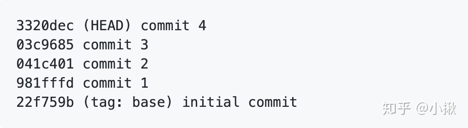
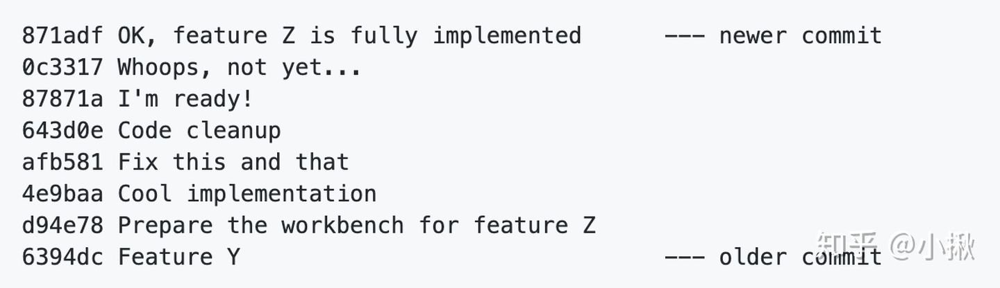
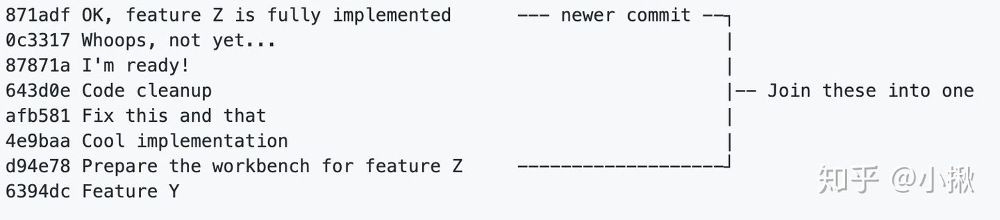
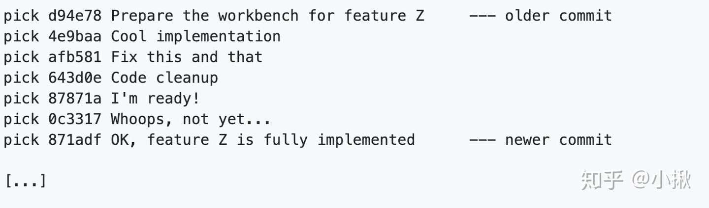
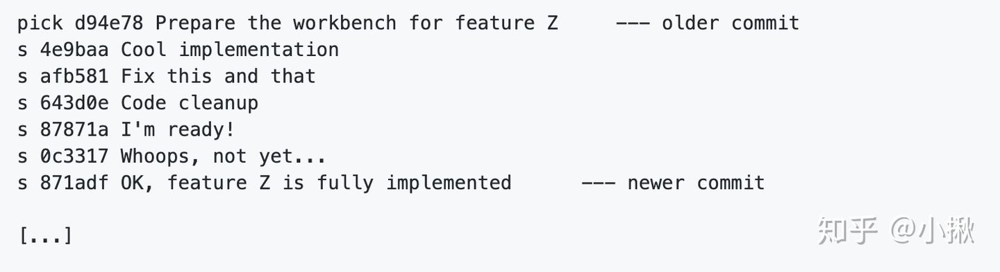
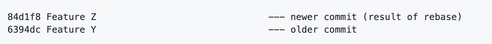
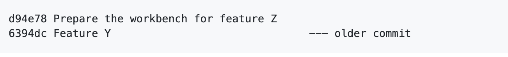
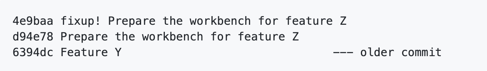
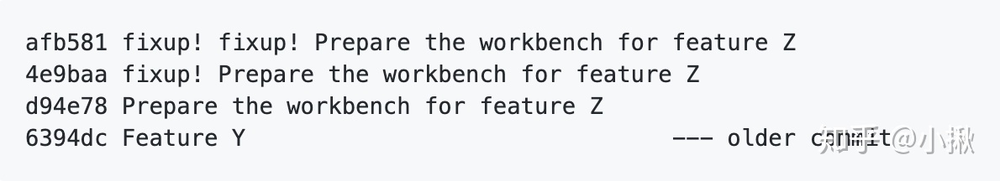
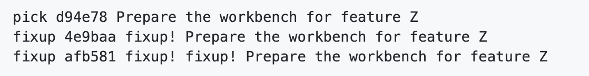

# git实践
### 1 修改上次的提交
```shell script
git add 
git commit --amend --no-edit
git push
```
### 2 分支合并前，合并多次提交
#### 2.1 应用场景
对于一个项目，你可能会多次提交代码，每次提交都对应一个`commit sha`  

  

当完成项目，要进行分支合并的时候，只想保留一个或某几个commit，这时候就需要合并commit了。
#### 2.2 如何合并
这里介绍两种方式，第一种是`git rebase`，第二种是`git rebase --autosquash`，后者在`git commit`时是有条件的。

1） git rebase
第一步，开启交互模式
```shell script
// 注意,这里的<commit_sha>是你针对此项目第一个提交的前一个提交的commit。
git rebase -i <commit_sha>
```

举个例子：

下面是工作中的提交记录：  

  


这时我们想要把前七个commit合并成一个，即：  
  


其中commit_sha是第一个提交的前一个提交的哈希。 因此，在我的示例中，命令为：

git rebase -i 6394dc
第二步，摘取合并

这时候会弹出一个框，列出了你想要合并的所有commit。注意列出的顺序是从老到新的。

  

更改commit_sha最前面的单词，我们打算把这七个合并成一个commit，那么更改如下：
  


保存退出后，又弹出一个新的框，让我们更改commit信息，编辑完后退出就好了。最后完成的效果如下：

  

2) git rebase --autosquash

顾名思义，就是会自动帮你压缩commit。但是你在git commit的时候需要使用特殊命令：

git commit --fixup=<commit_sha>
这里的commit_sha是指你对哪个commit进行了更改，所以必须先至少存在一个对该项目的提交。

举个例子：

下面是工作中的提交记录：

  

我现在有有了一个新的改动，那么在提交时，就需要用如下命令表明我是对上一个commit进行了更改：

git commit --fixup=d94e78
产生的效果是这样的：

  

这时候又有了一个新的改动，那么提交时的命令不变：

git commit --fixup=d94e78
产生的效果：

  

接下来我们进行合并操作：

git rebase --autosquash -i <commit_sha>
注意，这里的commit_sha是older commit6394dc。

Git这时会很机智的补全单词，不需要手动输入了。

  

直接保存退出，重新编辑提交信息即可。

以上两种方式，一种是提交时轻松，合并时麻烦，另外一种相反。可以根据喜好来选择使用。 

### 3 对特定项目设置用户名/邮箱/密码的方法
#### 3.1.找到项目所在目录下的 .git，进入.git文件夹，然后执行如下命令分别设置用户名和邮箱
```shell script
git config user.name "BugMakerPro"
git config user.email "511808895@qq.com"
```
然后执行命令查看config文件：
```shell script
cat config
```
发现里面多了刚才配置的用户名和邮箱信息user，即成功为该项目单独设置了用户名和邮箱
```shell script
...
[branch "master"]
    remote = origin
    merge = refs/heads/master
[user]
    name = BugMakerPro
    email = 511808895@qq.com

```

2.如果git pull 每次都要求输入用户名和密码，则可以执行如下配置
```shell script
git config credential.helper store
```
执行后，``` cat config```查看，则多了credential的内容：
```shell script
[user]
    name = BugMakerPro
    email = 511808895@qq.com
[credential]
        helper = store
```

然后再回到项目目录下执行`git pull/push`，根据提示输入用户名和密码，输入正确后，以后再执行git pull/push 就不用输入用户名和密码了
 
***参考***
> [知乎](https://zhuanlan.zhihu.com/p/139321091 "Markdown")  
>
> [简书](https://www.jianshu.com/p/bac094fb0222 "Markdown")
